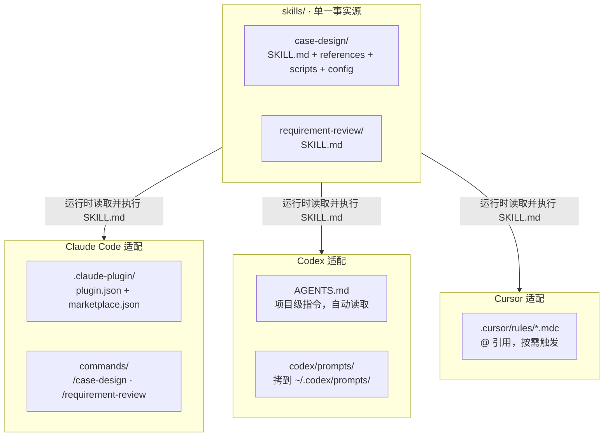

# QA Master

> 企业级 AI QA 工具集 —— 用「规格先行、测试驱动」的方式，把需求文档自动变成高质量、可执行、可追溯的测试用例，并对需求文档本身做多角色专家评审。


QA Master 提供两个核心能力，覆盖「需求评审 → 测试用例设计」的关键质量环节：

| Skill | 解决什么问题 | 产出 |
|---|---|---|
| **case-design** | 需求文档/原型 → 测试用例（Markdown / Excel） | 15 列标准化用例、澄清台账、知识总结、多需求索引 |
| **requirement-review** | 需求文档多角色并行评审 + 仲裁 + 重构 | 优化后的高质量需求文档 + 评审问题清单 |

两个 skill 的**正文统一存放在 `skills/` 下，为单一事实源，不随平台复制**。三个平台（Claude Code / Codex / Cursor）各自加一层薄引用包装，运行时读取对应 `SKILL.md` 执行。

---

## ✨ 特性

- **规格先行（SDD + TDD）**：先建模规则/状态/规格，再设计测试，禁止直接写用例。
- **风险优先**：按 P0–P3 风险分级，优先覆盖资金/支付/权限/状态流转/数据一致性等核心链路。
- **多角色协同**：case-design 引入开发/产品/业务视角（澄清路由 + 审核门禁，不增提问往返）；requirement-review 用 7 个专家 Agent 并行评审。
- **质量红线内建**：禁止脑补业务规则、禁止杜撰表名/字段/缓存 Key、禁止模糊断言、禁止过度设计、禁止跳过澄清。
- **渐进式加载，省 token**：case-design 常驻核心 ~6K tokens，各阶段细则按需读取 `references/`，回读核对用 `scripts/` 脚本返回摘要，不把整份用例读进上下文。
- **脚本化校验，可机器解析**：`verify_md.py`（结构）+ `verify_cases.py`（内容/覆盖）回读核对，Excel 经 `openpyxl` 脚本产出 + 结构验证 + 数据完整性校验。
- **跨会话可追溯**：澄清台账、知识总结、需求索引跨会话保留，不重复提问已解决问题。
- **按规模自动分级**：重型走完整 15 步、中型合并裁剪、轻型跳过规格建模；运行模式（完整 / 连跑 / 轻量）与流程深度正交。
- **单事实源配置**：`config/validation_rules.json` 集中校验口径，`config/domain_config.json` 支持金融/医疗等垂直领域扩展。

---

## 🧠 两个 Skill 详解

### 1. case-design —— 企业级测试用例设计

构建 `Requirement → Rule → Specification → Test Requirement → Test Model → Test Point → Test Case → Defect → Regression` 完整质量闭环。

**15 阶段主流程**：

```
0. 需求定位（MANIFEST 索引）   ──► 5. 风险分析（P0-P3）        ──► 10. 覆盖率校验 + 反向追溯
1. 需求分析 + 澄清（落盘台账） ──► 6. 测试策略匹配（决策表）   ──► 11. 输出前自查（14 项）
2. 测试需求分析                ──► 7. 测试点建模               ──► 12. 对话展示（投影 + 覆盖矩阵）
3. 规则建模                    ──► 8. 用例生成（G/W/T）        ──► 13. 一次性写入 .md + 脚本回读
4. 规格建模（SDD）             ──► 9. 去重                     ──► 14. 人工审核门禁 ─► 15. Excel 生成
```

**产出物**（统一写入项目根 `case-design-out/`）：

| 产出物 | 说明 |
|---|---|
| `MANIFEST.md` | 多需求快速定位索引（跨需求） |
| `Clarification_Ledger_<需求标识>.md` | 澄清问答台账，跨会话保留，避免重复提问 |
| `TestCases_<需求标识>.md` | 15 列标准化用例表（默认单文件） |
| `TestCases_<需求标识>.xlsx` | 与 .md 字段完全一致，用户确认后生成 |
| `Knowledge_<需求标识>.md` | 13 维度业务知识沉淀，审核通过后生成 |

> 详细使用说明见 [`skills/case-design/README.md`](skills/case-design/README.md) 与 [`skills/case-design/一分钟上手.md`](skills/case-design/一分钟上手.md)。

### 2. requirement-review —— 需求文档多角色评审

内部包含 7 个专家 Agent，按「并行评审 + 汇总仲裁」模式工作：

**7 个 Agent**：`BA（业务分析）` · `PM（产品设计）` · `QA（测试设计）` · `Arch（技术架构）` · `UX（用户体验）` · `Risk（风险控制）` · `Dev（开发实现）`

**九阶段流程**：

```
1. 并行评审      ──► 4. 优化方案总览（P0/P1/P2 + 影响范围）
2. 结果汇总去重  ──► 5. 用户确认（必须等待，未确认禁入下一步）
3. 冲突检测      ──► 6. 需求文档重构（多 Agent 融合版）
                  ──► 7. 自动复查 ─► 8. 二次修复 ─► 9. 最终输出
```

每个 Agent 独立思考、并行输出，标注 `✅已满足 / ❌不满足 / ⚠风险项`；Review Master 汇总去重并检测 Agent 间冲突（业务 vs 技术、体验 vs 风控），输出权衡推荐方案。产出落盘到项目根 `requirement-review-out/` 目录。

---

## 🏗️ 架构：单一事实源 + 薄引用包装



**三条设计原则**：

- **单一事实源**：skill 正文只在 `skills/`，三平台不复制，零漂移。
- **薄引用包装**：各平台适配文件只指引「读取并执行对应 SKILL.md」，不内嵌正文。
- **skill 正文不改**：新增平台只在外围加适配，不碰 `skills/**` 内容。

---

## 🚀 快速开始

### 平台一：Claude Code（原生 plugin）

本仓库根目录即一个 Claude Code plugin（含 `.claude-plugin/plugin.json` + `marketplace.json`）。`skills/` 下两个 skill 原生可发现，`commands/` 提供 `/case-design`、`/requirement-review` 显式触发。

**安装**：

```
/plugin marketplace add xiaozhi86/qamaster
/plugin install qamaster@qamaster
```

> 也可用本地路径：`/plugin marketplace add <本仓库本地路径>`

**使用**：

```
/case-design
/requirement-review
```

> 两个 skill 均设了 `disable-model-invocation: true`（不自动触发），故通过上述 `/` 命令显式调用；若你的版本下 `/` 命令未自动唤起 skill，直接说「使用 case-design skill」即可。

### 平台二：Codex（AGENTS.md + 自定义 prompt）

Codex 无 plugin 市场，「插件」= `AGENTS.md`（项目级指令，Codex 自动读取）+ 自定义 prompt（`~/.codex/prompts/`）。

**安装**：

1. 把本仓库（或至少 `skills/` + `AGENTS.md`）放入你的项目根，Codex 在该项目运行时自动读 `AGENTS.md`。
2. 把 `codex/prompts/*.md` 拷贝到 `~/.codex/prompts/`，获得 `/case-design`、`/requirement-review` slash 命令。

**使用**：

```
/case-design
/requirement-review
```

或直接说「用 case-design skill 设计测试用例」，Codex 会按 `AGENTS.md` 读取 `skills/case-design/SKILL.md` 执行。

> prompt 以薄引用方式指向 `skills/.../SKILL.md`，需 `skills/` 位于当前项目根。

### 平台三：Cursor（`.cursor/rules/*.mdc`）

Cursor 无 plugin 市场，「插件」= `.cursor/rules/` 下的 rule 文件。

**安装**：把本仓库（或至少 `skills/` + `.cursor/rules/`）作为项目根；Cursor 自动发现 `.cursor/rules/*.mdc`。

**使用**：两个 rule 均为 `alwaysApply: false`（按需触发，不污染上下文）。在对话中用 `@case-design` 或 `@requirement-review` 引用，或涉及测试用例设计 / 需求评审时让 Cursor 自动拉取。

> rule 以薄引用方式指向 `skills/.../SKILL.md`，需 `skills/` 位于项目根。

---

## 📝 用法示例（case-design）

**1. 触发并提供需求**：

```
/case-design

【需求标识】
订单创建-20260702

【业务需求描述】
<<<需求文档开始>>>
用户在购物车点击"提交订单"，系统创建订单，状态为"待支付"，扣减库存，发送订单创建消息。
订单金额 = 商品单价 × 数量。数量需为 1-99 整数。
<<<需求文档结束>>>
```

**2. 回答澄清问题**（存在 P0/P1 时会暂停等待，可批量回复）：

```
Q1 按方案A，Q2 按方案B
```

**3. 审核回复**（用例生成后停下等审核）：

- 没问题 → `审核通过` → 自动生成知识总结，并询问是否生成 Excel。
- 有问题 → 直接说改哪里，如 `TestCases_xxx 断言改为返回400` → 改完再请你审核。

**4. 产出用例（15 列，节选）**：

| 用例ID | 关联规则 | 测试类型 | 用例名称 | Given | When | Then | 用例等级 |
|---|---|---|---|---|---|---|---|
| ..._CREATE_001 | 订单创建主流程 | 功能 | 【订单】【创建】【库存充足】【成功】 | 已登录；购物车有商品 | 提交订单 | 返回200 SUCCESS；订单状态=待支付；库存-2 | P0 |
| ..._CREATE_002 | 数量边界 | 边界 | 【订单】【数量边界1与99】【成功】 | 已登录 | 数量=1、=99 提交 | 返回200；创建成功 | P1 |
| ..._CREATE_003 | 数量非法 | 异常 | 【订单】【数量0与100非法】【参数错误】 | 已登录 | 数量=0、=100 提交 | 返回400 PARAM_INVALID；未创建 | P2 |
| ..._CREATE_004 | 重复提交幂等 | 幂等 | 【订单】【并发重复提交】【仅一个订单】 | 已登录 | 同一请求连续提交两次 | 仅1个订单；库存仅扣一次 | P1 |

> 完整端到端范例见 [`skills/case-design/references/example.md`](skills/case-design/references/example.md)。

---

## 🎛️ 运行模式（case-design）

在输入开头声明触发词即可切换模式：

| 模式 | 触发词 | 澄清门禁 | .md 审核 | 适用 |
|---|---|---|---|---|
| **完整**（默认） | 无 | 全部缺口停止提问 | 必须等人工通过 | 关键需求、需强人工把控 |
| **连跑** | `连跑` / `自动跑` / `批量` | 仅 P0/P1 阻断，其余记假设继续 | 标注「待审核」后推进 | 多模块批量、信任度高 |
| **轻量** | `轻量` / `小改` / `低风险` | 仅阻断 P0 | 同连跑 | 字段校验、文案、低风险参数 |

> 自动放行**只放宽「等待人工」时点，不放宽任何质量底线**（脑补禁令 / 断言可观测 / 存储合规 / 去重 / 覆盖率等全不变）。

---

## 📦 依赖

| 组件 | 要求 | 说明 |
|---|---|---|
| AI 平台 | Claude Code / Codex / Cursor 任一 | 三平台任选其一即可 |
| **Python** | 3.7+ | case-design 的回读校验与 Excel 生成脚本在 `skills/case-design/scripts/` |
| **openpyxl** | 仅生成 Excel 时需要 | 缺失时 skill 自动尝试 `pip install` 并兜底报错 |

```bash
pip install openpyxl      # Windows
pip3 install openpyxl     # macOS / Linux
```

> 四个自带脚本（`verify_md.py`、`verify_cases.py`、`verify_knowledge.py`、`project_cases.py`）只用 Python 标准库，无 openpyxl 也能运行（仅不能产出 Excel）。
>
> skill 正文中部分建议（`CLAUDE_CODE_MAX_OUTPUT_TOKENS`、`.claude/settings.json`、`acceptEdits`）为 Claude Code 专属；Codex/Cursor 用户忽略，用各自平台机制等价实现。

---

## 📁 目录结构

```
.
├─ skills/                          # 单一事实源（不随平台复制）
│  ├─ case-design/                  # 测试用例设计 skill
│  │  ├─ SKILL.md                   # 常驻核心（frontmatter + 主流程 + ref 索引）
│  │  ├─ README.md                  # 详细使用说明
│  │  ├─ 一分钟上手.md              # 极简上手卡片
│  │  ├─ references/                # 各阶段细则（按需读取，不常驻）
│  │  ├─ scripts/                   # 降本脚本（回读核对 / 知识综合，自动调用）
│  │  └─ config/                    # 校验规则 + 领域配置（单一事实源）
│  └─ requirement-review/           # 需求评审 skill
│     └─ SKILL.md
├─ .claude-plugin/                  # 平台一：Claude Code
│  ├─ plugin.json
│  └─ marketplace.json
├─ commands/                        # Claude Code slash 命令
├─ AGENTS.md                        # 平台二：Codex 项目指令
├─ codex/prompts/                   # Codex 自定义 prompt（拷到 ~/.codex/prompts/）
├─ .cursor/rules/                   # 平台三：Cursor rule
├─ scripts/check_plugin.py          # 插件结构自检
└─ .github/workflows/check-plugin.yml  # CI
```

---

## 🧪 开发与 CI

本项目带一个结构自检脚本，CI 与本地均可运行：

```bash
python scripts/check_plugin.py
```

该校验检查三平台适配层与 skills 结构完整性：`plugin.json` / `marketplace.json` 字段、各 `SKILL.md` frontmatter、`commands/` 与 `.cursor/rules/` frontmatter、Codex 适配必要文件、以及不应入库的 `__pycache__`/`.pyc`。CI 还会字节编译 skill 脚本做语法检查。

本地运行完整检查：

```bash
python scripts/check_plugin.py            # 插件结构自检
python -m py_compile skills/case-design/scripts/*.py   # 脚本语法检查
python skills/case-design/scripts/verify_cases.py --dump-rules   # 打印校验规则契约
```

---

## ❓ FAQ

**Q：skill 没被识别 / `/case-design` 无效？**
检查：① `skills/<name>/SKILL.md` 是否存在且 frontmatter 完整；② 是否（重新）打开了会话；③ Claude Code 下是否已 `/plugin install`。

**Q：提示找不到 Python / `python` 命令？**
Windows 从 python.org 装真实 Python 并勾选 Add to PATH；macOS/Linux 用 `python3`。若 Windows 的 `python` 指向 Microsoft Store 占位符，请从 python.org 安装。

**Q：生成 Excel 失败，报 openpyxl 缺失？**
执行 `pip install openpyxl`（Windows）/ `pip3 install openpyxl`（macOS/Linux）后重试。缺失时 skill 会自动尝试安装；自动安装失败会显式报错，不会静默降级。

**Q：每次都重复问已经回答过的问题？**
说明澄清台账未落盘或项目根目录变了。确认：① 完整模式下回答后 skill 已写 `Clarification_Ledger_*.md`；② 在同一项目根目录续跑。换项目根目录会视为首次。

**Q：用例很多，一次写不完？**
skill 会做写前规模评估：默认单文件；单次 Write 预估 > 24000 token 先压缩，压缩后仍超才按风险排序拆最小 PART。重型批量场景可设 `CLAUDE_CODE_MAX_OUTPUT_TOKENS=48000` 抬高单次上限。

---

## 📄 License

[MIT](LICENSE) © 2026 xiaozhi
