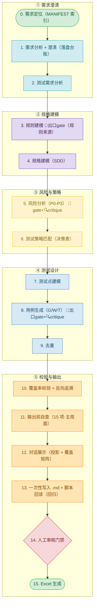
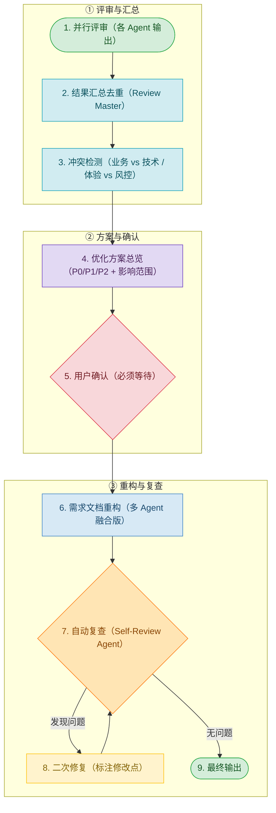
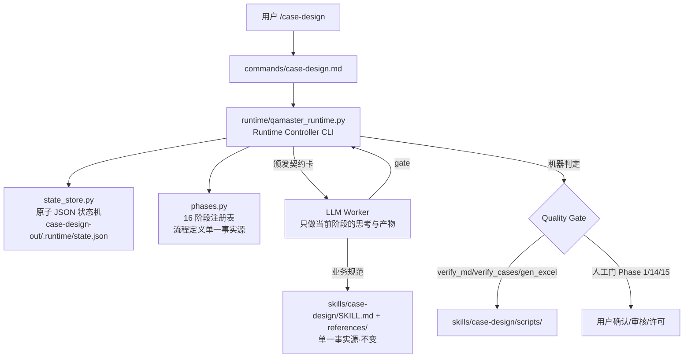

# QA Master

> 企业级 AI QA 工具集 —— 用「规格先行、测试驱动」的方式，把需求文档自动变成高质量、可执行、可追溯的测试用例，并对需求文档本身做多角色专家评审。


QA Master 提供两个核心能力，覆盖「需求评审 → 测试用例设计」的关键质量环节：

| Skill | 解决什么问题 | 产出 |
|---|---|---|
| **case-design** | 需求文档/原型 → 测试用例（Markdown / Excel） | 15 列标准化用例、澄清台账、知识总结、多需求索引 |
| **requirement-review** | 需求文档多角色并行评审 + 仲裁 + 重构 | 优化后的高质量需求文档 + 评审问题清单 |

两个 skill 的**正文统一存放在 `skills/` 下，为单一事实源，不随平台复制**。三个平台（Claude Code / Codex / Cursor）各自加一层薄引用包装，运行时读取对应 `SKILL.md` 执行。

---

## ✨ 特性

- **规格先行（SDD + TDD）**：先建模规则/状态/规格，再设计测试，禁止直接写用例。
- **风险优先**：按 P0–P3 风险分级，优先覆盖资金/支付/权限/状态流转/数据一致性等核心链路。
- **多角色协同**：case-design 引入开发/产品/业务视角（澄清路由 + 审核门禁，不增提问往返）；requirement-review 用 7 个专家 Agent 并行评审。
- **阶段出口校验，agent-loop 式有界纠错**：第3/5/8阶段在写前于**内存内**跑机器检查（`verify_cases.py run_inmemory`，≤2 轮有界自修，零临时文件）；第5/8阶段另加**有界对抗式 critique 循环**（≤2 轮，查机器查不出的"P0 漏标""漏测用例"，检查14 含**界面结构遗漏**盲区）；第11阶段写前 LLM 自查（≤3 轮）+ 第13阶段写后回读。机器判定与主观对抗分层、5 个有界循环各自独立计数不嵌套——缺陷在阶段出口就地拦住，不聚合到写后才反向捕获。
- **UI 类测试子维度完备**（0.5.0）：UI 测试锚定"界面结构是否正确承载业务规则/数据/权限/状态"（查询条件项默认/单条件/组合/重置、列表字段映射/分页/排序/四态区分/脱敏、表单联动回显、按业务态启用按钮、权限 UI），不测元素存在/框架渲染；8 子维 + 边界表（不与输入/数据/接口类重复）+ 适度性校准（按风险分级，防爆炸）。0.1 禁令已精确剥离，业务 UI 承载测试不再被反向劝退。
- **质量红线内建**：禁止脑补业务规则、禁止杜撰表名/字段/缓存 Key、禁止模糊断言、禁止过度设计、禁止跳过澄清。
- **渐进式加载，省 token**：case-design 常驻核心 ~6K tokens，各阶段细则按需读取 `references/`，回读核对用 `scripts/` 脚本返回摘要，不把整份用例读进上下文；阶段出口机器 gate 在内存内跑同一套校验，零权限弹窗。
- **脚本化校验，可机器解析**：`verify_md.py`（结构）+ `verify_cases.py`（内容/覆盖，文件入口 + 内存入口 `run_inmemory`）回读核对，Excel 经 `openpyxl` 脚本产出 + 结构验证 + 数据完整性校验。
- **跨会话可追溯**：澄清台账、知识总结、需求索引跨会话保留，不重复提问已解决问题。
- **按规模自动分级**：重型走完整 15 步、中型合并裁剪、轻型跳过规格建模；运行模式（完整 / 连跑 / 轻量）与流程深度正交；阶段出口 gate 全规模必跑（轻型不跳）。
- **单事实源配置**：`config/validation_rules.json` 集中校验口径（含边界值 4 值模型），`config/domain_config.json` 支持金融/医疗等垂直领域扩展。

---

## 🧠 两个 Skill 详解

### 1. case-design —— 企业级测试用例设计

构建 `Requirement → Rule → Specification → Test Requirement → Test Model → Test Point → Test Case → Defect → Regression` 完整质量闭环。

**15 阶段主流程**（第3/5/8阶段含出口机器 gate + 第5/8阶段含对抗式 critique 循环）：



> 🔧 = 阶段出口机器 gate（`verify_cases.py` 在内存内跑，≤2 轮有界自修，零临时文件）；🔍 = 对抗式 critique 循环（≤2 轮，查机器查不出的漏标/漏测）。机器 gate 与 critique 检查项不相交、计数独立；第8 gate 与第11自查循环亦独立不嵌套（防无限循环）。详见 [`skills/case-design/references/modeling.md`](skills/case-design/references/modeling.md) §15.7。

**产出物**（统一写入项目根 `case-design-out/`）：

| 产出物 | 说明 |
|---|---|
| `MANIFEST.md` | 多需求快速定位索引（跨需求） |
| `Clarification_Ledger_<需求标识>.md` | 澄清问答台账，跨会话保留，避免重复提问 |
| `TestCases_<需求标识>.md` | 15 列标准化用例表（默认单文件） |
| `TestCases_<需求标识>.xlsx` | 与 .md 字段完全一致，用户确认后生成 |
| `Knowledge_<需求标识>.md` | 13 维度业务知识沉淀，审核通过后生成 |

> 详细使用说明见 [`skills/case-design/README.md`](skills/case-design/README.md) 与 [`skills/case-design/一分钟上手.md`](skills/case-design/一分钟上手.md)。

### 2. requirement-review —— 需求文档多角色评审

内部包含 7 个专家 Agent，按「并行评审 + 汇总仲裁」模式工作：

**7 个 Agent**：`BA（业务分析）` · `PM（产品设计）` · `QA（测试设计）` · `Arch（技术架构）` · `UX（用户体验）` · `Risk（风险控制）` · `Dev（开发实现）`

**九阶段流程**：



每个 Agent 独立思考、并行输出，标注 `✅已满足 / ❌不满足 / ⚠风险项`；Review Master 汇总去重并检测 Agent 间冲突（业务 vs 技术、体验 vs 风控），输出权衡推荐方案。产出落盘到项目根 `requirement-review-out/` 目录。

---

## 🏗️ 架构：Agent Runtime Engineering（模型无关的流程强制）

> **模型负责思考，Runtime 负责控制。** 自 v0.6 起，case-design 的 0-14(+Excel) 阶段流程不再依赖模型的指令遵循能力，而由内置 Python 状态机（`runtime/`）裁决：阶段迁移、质量门禁、人工确认点全部代码化，**任何模型（Claude / GPT / GLM / Gemini / DeepSeek）都不可绕过**。



**三条设计原则**（在原有"单一事实源 + 薄引用"之上新增第 1 条）：

- **Runtime 控制流程**：`runtime/qamaster_runtime.py` 是唯一权威控制点。每阶段向模型颁发【RUNTIME CONTRACT 契约卡】（当前阶段/允许动作/禁止动作/产出物/出口门禁）；`gate` 由确定性检查 + skill 自带校验脚本判定，**禁止模型自证**；人工门（澄清/审核/Excel 许可）未确认前状态机不放行。
- **单一事实源**：skill 正文仍只在 `skills/`，三平台不复制，零漂移。Runtime 只做流程控制，**不改变任何业务规则**（避坑红线/输入协议/运行模式/质量门禁仍以 SKILL.md + references/ 为唯一细则来源）。
- **薄引用包装**：Claude Code 用 `commands/` 启动 Runtime；Codex/Cursor 无 Runtime 时退回 SKILL.md 的 15 阶段定义执行（行为一致，仅缺代码级强制）。

**流程保障机制**：

| 机制 | 实现 | 防什么 |
|---|---|---|
| 非法跳转拦截 | `next` 只允许 current+1（按深度裁剪序列），否则 RUNTIME_ERROR | 模型跳阶段/合并阶段 |
| 机器质量门 | Phase 0（REQ+MANIFEST 落盘）、Phase 13（verify_md+verify_cases 回读）、Phase 15（gen_excel 生成+校验） | 产物缺失/不合格却自称完成 |
| 人工确认门 | Phase 1 澄清 / Phase 14 审核 / Phase 15 Excel 许可；完整模式必须用户 confirm | 跳过澄清/默认审核通过/未经许可生成 Excel |
| 断点续跑 | 状态落盘 `case-design-out/.runtime/state.json`；二次 `start` 恢复而非重置；上下文压缩后 `status` 恢复权威状态 | 长会话状态丢失、重复生成覆盖 |
| 审核反馈回退 | `fail --to <阶段>` 回退到受影响最深阶段，从起点依次重走到 Phase 14 | 修改场景跳阶段 |
| 自证测试 | `scripts/test_runtime.py`：57 项断言覆盖全程 15 阶段、非法跳转、门禁失败、回退、Excel 生成、断点续跑、连跑放行 | Runtime 自身正确性 |

> 设计方案见 [`qamaster-Agent-Runtime-Engineering-Refactor-Design-v1.0.0.md`](qamaster-Agent-Runtime-Engineering-Refactor-Design-v1.0.0.md)。

---

## 🚀 快速开始

> 三平台通用。**Claude Code 用户直接看下方「平台一」**（两条命令、GitHub 自动下载、最省事）；Codex / Cursor 见各自小节。

### 平台一：Claude Code（原生 plugin·推荐）

> **最简路径**：仓库已公开，Claude Code 会自动从 GitHub 下载整个仓库并安装，无需你手动 `git clone`。两条命令搞定，适合零基础。CLI / 桌面 app / web / IDE 插件用法一致。

**前置**：已安装 Claude Code；能联网；浏览器能匿名打开 `https://github.com/xiaozhi86/qamaster`（已公开）。

#### 步骤 1 — 添加 marketplace（自动从 GitHub 下载）

在 Claude Code 对话输入框直接输入下面这条（`/plugin` 是 Claude Code 命令，不是 shell，**不要**加 `!` 前缀）：

```
/plugin marketplace add xiaozhi86/qamaster
```

- Claude Code 自动从 `https://github.com/xiaozhi86/qamaster` 克隆仓库到本地缓存，读取 `.claude-plugin/marketplace.json`，注册名为 `qamaster` 的 marketplace。
- 首次添加第三方 marketplace 会弹**信任确认** -> 选 **Yes / 信任**。
- 看到类似「marketplace `qamaster` 添加成功，含 1 个插件」即完成。

#### 步骤 2 — 安装插件

```
/plugin install qamaster@qamaster
```

- 格式为 `插件名@marketplace名`，本工程两者都叫 `qamaster`。
- 可能再弹**启用确认** -> 确认启用。
- 安装后自动注册：2 个 skill（`case-design`、`requirement-review`）+ 2 个斜杠命令（`/case-design`、`/requirement-review`）。
- 也可图形化操作：输入 `/plugin` 打开界面 -> 找到 `qamaster` -> Install。

#### 步骤 3 — 新开一个会话（关键，常被忽略）

插件里的 skill 和命令**只在新会话才会加载**。关掉当前会话、重新开一个，否则装了也触发不了。

#### 步骤 4 — 验证安装成功

1. 输入 `/plugin` 打开管理界面 -> 能看到 `qamaster`，状态为 **enabled**。
2. 新会话里输入 `/case-design` -> 能自动补全并触发。

两条都满足即安装成功。

#### 步骤 5 — 使用

```
/case-design
/requirement-review
```

> 两个 skill 均设了 `disable-model-invocation: true`（不自动触发），必须用 `/` 命令显式调用；若你的版本下 `/` 命令未唤起 skill，直接说「使用 case-design skill」即可。

#### 后续：更新 / 卸载

- **更新**（你 `git push` 新版本后）：`/plugin marketplace update qamaster`，或 `/plugin` 界面里 Update；完成后**新开会话**生效。
- **卸载**：`/plugin uninstall qamaster`，或 `/plugin` 界面卸载。

#### 备选：本地路径安装（开发 / 即时生效用）

不想走 GitHub、或想用本地未推送的改动：

```
/plugin marketplace add D:/qamaster
/plugin install qamaster@qamaster
```

> 远程方式拉的是 GitHub 上的版本；本地未 `git push` 的改动只有本地路径方式才能立即生效。

#### 常见问题

| 现象 | 处理 |
| --- | --- |
| 步骤 1 报 404 / 无权限 | 仓库被设回私有；确认 `https://github.com/xiaozhi86/qamaster` 能匿名打开 |
| 装完 `/case-design` 没反应 | 没新开会话；或插件未 enabled（`/plugin` 看状态） |
| skill 跑起来脚本报错 | 装 Python 3.7+（Windows 用 python.org 真 Python）；要生成 Excel 再 `pip install openpyxl` |
| 拉到旧版本 | 本地改动没 `git push`；先 push 再 `/plugin marketplace update qamaster` |

### 平台二：Codex（AGENTS.md + 自定义 prompt）

Codex 无 plugin 市场，「插件」= `AGENTS.md`（项目级指令，Codex 自动读取）+ 自定义 prompt（`~/.codex/prompts/`）。

**安装**：

1. 把本仓库（或至少 `skills/` + `AGENTS.md`）放入你的项目根，Codex 在该项目运行时自动读 `AGENTS.md`。
2. 把 `codex/prompts/*.md` 拷贝到 `~/.codex/prompts/`，获得 `/case-design`、`/requirement-review` slash 命令。

**使用**：

```
/case-design
/requirement-review
```

或直接说「用 case-design skill 设计测试用例」，Codex 会按 `AGENTS.md` 读取 `skills/case-design/SKILL.md` 执行。

> prompt 以薄引用方式指向 `skills/.../SKILL.md`，需 `skills/` 位于当前项目根。

### 平台三：Cursor（`.cursor/rules/*.mdc`）

Cursor 无 plugin 市场，「插件」= `.cursor/rules/` 下的 rule 文件。

**安装**：把本仓库（或至少 `skills/` + `.cursor/rules/`）作为项目根；Cursor 自动发现 `.cursor/rules/*.mdc`。

**使用**：两个 rule 均为 `alwaysApply: false`（按需触发，不污染上下文）。在对话中用 `@case-design` 或 `@requirement-review` 引用，或涉及测试用例设计 / 需求评审时让 Cursor 自动拉取。

> rule 以薄引用方式指向 `skills/.../SKILL.md`，需 `skills/` 位于项目根。

---

## 📝 用法示例（case-design）

**1. 触发并提供需求**：

```
/case-design

【需求标识】
订单创建-20260702

【业务需求描述】
<<<需求文档开始>>>
用户在购物车点击"提交订单"，系统创建订单，状态为"待支付"，扣减库存，发送订单创建消息。
订单金额 = 商品单价 × 数量。数量需为 1-99 整数。
<<<需求文档结束>>>
```

**2. 回答澄清问题**（存在 P0/P1 时会暂停等待，可批量回复）：

```
Q1 按方案A，Q2 按方案B
```

**3. 审核回复**（用例生成后停下等审核）：

- 没问题 → `审核通过` → 自动生成知识总结，并询问是否生成 Excel。
- 有问题 → 直接说改哪里，如 `TestCases_xxx 断言改为返回400` → 改完再请你审核。

**4. 产出用例（15 列，节选）**：

| 用例ID | 关联规则 | 测试类型 | 用例名称 | Given | When | Then | 用例等级 |
|---|---|---|---|---|---|---|---|
| ..._CREATE_001 | 订单创建主流程 | 功能 | 【订单】【创建】【库存充足】【成功】 | 已登录；购物车有商品 | 提交订单 | 返回200 SUCCESS；订单状态=待支付；库存-2 | P0 |
| ..._CREATE_002 | 数量边界 | 边界 | 【订单】【数量边界1与99】【成功】 | 已登录 | 数量=1、=99 提交 | 返回200；创建成功 | P1 |
| ..._CREATE_003 | 数量非法 | 异常 | 【订单】【数量0与100非法】【参数错误】 | 已登录 | 数量=0、=100 提交 | 返回400 PARAM_INVALID；未创建 | P2 |
| ..._CREATE_004 | 重复提交幂等 | 幂等 | 【订单】【并发重复提交】【仅一个订单】 | 已登录 | 同一请求连续提交两次 | 仅1个订单；库存仅扣一次 | P1 |

> 完整端到端范例见 [`skills/case-design/references/example.md`](skills/case-design/references/example.md)。

---

## 🎛️ 运行模式（case-design）

在输入开头声明触发词即可切换模式：

| 模式 | 触发词 | 澄清门禁 | .md 审核 | 适用 |
|---|---|---|---|---|
| **完整**（默认） | 无 | 全部缺口停止提问 | 必须等人工通过 | 关键需求、需强人工把控 |
| **连跑** | `连跑` / `自动跑` / `批量` | 仅 P0/P1 阻断，其余记假设继续 | 标注「待审核」后推进 | 多模块批量、信任度高 |
| **轻量** | `轻量` / `小改` / `低风险` | 仅阻断 P0 | 同连跑 | 字段校验、文案、低风险参数 |

> 自动放行**只放宽「等待人工」时点，不放宽任何质量底线**（脑补禁令 / 断言可观测 / 存储合规 / 去重 / 覆盖率等全不变）；阶段出口机器 gate 全规模必跑（轻型不跳），仅连跑/轻量模式下 P2/P3 命中可记假设放行，P0/P1 硬阻断仍停。

---

## 🔁 阶段出口校验机制（case-design）

> 借鉴 agent loop 的「act → check → repair → re-check」循环结构（有界轮次 + 失败升级），不引入多 subagent critique 形态——机器信号复用已有 `verify_cases.py`，critique 仅在机器查不出的两处（P0 漏标、漏测用例）投入。

| 阶段出口 | 机器 gate（客观，≤2 轮） | critique 循环（主观对抗，≤2 轮） |
|---|---|---|
| 3 规则建模 | `check_rule_source`（规则来源标注） | — |
| 5 风险分析 | `risk_source_report`（风险来源/结构） | P0 漏标对抗式第二视角（7 类高发漏标方向） |
| 8 用例生成 | `verify_cases.py run_inmemory` 全量（枚举/边界/覆盖/追溯/断言/来源） | 检查14 对抗生成遍（边界组合/异常子类/状态机非法流转/并发竞态） |
| 11 写前自查 | （机器面已由第8修，降为确认） | selfcheck 主循环 ≤3 轮（数据一致性/自动化友好/AI可解析主观面/对抗遍 + 阻断决策） |
| 13 写后回读 | 全量回归（不缩范围，防检查14新增用例引入机器缺陷） | — |

- **机器 gate 与 critique 检查项不相交**：gate 查"已有的机器可判缺陷"，critique 查"该有却没有的漏标/漏测"——无重叠、计数独立。
- **5 个有界循环各自独立不嵌套**：第5机器 gate / 第5 critique / 第8机器 gate / 第8 critique / 第11自查，单向衔接（critique 补出新用例须回跑第8 gate），无无限循环。
- **内存内、零文件操作**：gate 输入即 Write 的 `content` 本身，纯函数、零临时文件、零权限弹窗，契合「落盘前零文件操作」铁律。

---

## 📦 依赖

| 组件 | 要求 | 说明 |
|---|---|---|
| AI 平台 | Claude Code / Codex / Cursor 任一 | 三平台任选其一即可 |
| **Python** | 3.7+ | case-design 的回读校验与 Excel 生成脚本在 `skills/case-design/scripts/` |
| **openpyxl** | 仅生成 Excel 时需要 | 缺失时 skill 自动尝试 `pip install` 并兜底报错 |

```bash
pip install openpyxl      # Windows
pip3 install openpyxl     # macOS / Linux
```

> 四个自带脚本（`verify_md.py`、`verify_cases.py`、`verify_knowledge.py`、`project_cases.py`）只用 Python 标准库，无 openpyxl 也能运行（仅不能产出 Excel）。
>
> skill 正文中部分建议（`CLAUDE_CODE_MAX_OUTPUT_TOKENS`、`.claude/settings.json`、`acceptEdits`）为 Claude Code 专属；Codex/Cursor 用户忽略，用各自平台机制等价实现。

---

## 📁 目录结构

```
.
├─ runtime/                         # ★ Agent Runtime（流程状态机，模型无关的流程强制）
│  ├─ qamaster_runtime.py           # Runtime Controller CLI（start/status/next/gate/confirm/reject/fail/set/plan/verify）
│  ├─ state_store.py                # 权威状态存储（原子 JSON 读写）
│  └─ phases.py                     # 0-14(+Excel) 阶段注册表（流程定义单一事实源）
├─ skills/                          # 业务规范单一事实源（不随平台复制）
│  ├─ case-design/                  # 测试用例设计 skill
│  │  ├─ SKILL.md                   # 常驻核心（frontmatter + Runtime 控制协议 + 主流程 + ref 索引）
│  │  ├─ README.md                  # 详细使用说明
│  │  ├─ 一分钟上手.md              # 极简上手卡片
│  │  ├─ references/                # 各阶段细则（按需读取，不常驻）
│  │  ├─ scripts/                   # 降本脚本（回读核对 / 知识综合，Runtime 门禁复用）
│  │  └─ config/                    # 校验规则 + 领域配置（单一事实源）
│  └─ requirement-review/           # 需求评审 skill
│     └─ SKILL.md
├─ .claude-plugin/                  # 平台一：Claude Code
│  ├─ plugin.json
│  └─ marketplace.json
├─ commands/                        # Claude Code slash 命令（case-design 启动 Runtime）
├─ AGENTS.md                        # 平台二：Codex 项目指令
├─ codex/prompts/                   # Codex 自定义 prompt（拷到 ~/.codex/prompts/）
├─ .cursor/rules/                   # 平台三：Cursor rule
├─ scripts/check_plugin.py          # 插件结构自检（含 Runtime 完整性校验）
├─ scripts/test_runtime.py          # Runtime 自证测试（57 项断言，无 LLM）
└─ .github/workflows/check-plugin.yml  # CI
```

---

## 🧪 开发与 CI

本项目带结构自检与 Runtime 自证测试，CI 与本地均可运行：

```bash
python scripts/check_plugin.py
python scripts/test_runtime.py
```

`check_plugin.py` 校验三平台适配层、skills 结构与 **Runtime 完整性**：`plugin.json` / `marketplace.json` 字段、各 `SKILL.md` frontmatter、`commands/` 与 `.cursor/rules/` frontmatter、Codex 适配必要文件、`runtime/` 核心文件存在性 + 阶段注册表（编号 0-15 连续、人工门/许可门类型、引用细则存在）、以及不应入库的 `__pycache__`/`.pyc`。CI 还会字节编译 runtime 与 skill 脚本做语法检查。

`test_runtime.py` 为 Runtime 自证测试（无 LLM，57 项断言）：全程模拟 0-15 阶段流程、非法跳转拒绝、人工门未确认阻断、机器门失败停留、审核反馈回退重走、审核通过→知识沉淀→Excel 真实生成（openpyxl 缺失时自动降级测 reject 路径）、断点续跑、连跑模式审核门自动放行（审计痕迹）、深度裁剪。

本地运行完整检查：

```bash
python scripts/check_plugin.py            # 插件结构自检（含 Runtime 完整性）
python scripts/test_runtime.py            # Runtime 自证测试（57 项断言，无 LLM）
python -m py_compile runtime/*.py skills/case-design/scripts/*.py   # 脚本语法检查
python skills/case-design/scripts/verify_cases.py --dump-rules      # 打印校验规则契约
```

---

## ❓ FAQ

**Q：skill 没被识别 / `/case-design` 无效？**
检查：① `skills/<name>/SKILL.md` 是否存在且 frontmatter 完整；② 是否（重新）打开了会话；③ Claude Code 下是否已 `/plugin install`。

**Q：提示找不到 Python / `python` 命令？**
Windows 从 python.org 装真实 Python 并勾选 Add to PATH；macOS/Linux 用 `python3`。若 Windows 的 `python` 指向 Microsoft Store 占位符，请从 python.org 安装。

**Q：生成 Excel 失败，报 openpyxl 缺失？**
执行 `pip install openpyxl`（Windows）/ `pip3 install openpyxl`（macOS/Linux）后重试。缺失时 skill 会自动尝试安装；自动安装失败会显式报错，不会静默降级。

**Q：每次都重复问已经回答过的问题？**
说明澄清台账未落盘或项目根目录变了。确认：① 完整模式下回答后 skill 已写 `Clarification_Ledger_*.md`；② 在同一项目根目录续跑。换项目根目录会视为首次。

**Q：用例很多，一次写不完？**
skill 会做写前规模评估：默认单文件；单次 Write 预估 > 24000 token 先压缩，压缩后仍超才按风险排序拆最小 PART。重型批量场景可设 `CLAUDE_CODE_MAX_OUTPUT_TOKENS=48000` 抬高单次上限。

**Q：阶段出口校验会不会拖慢或卡死？**
不会无限循环。5 个有界循环（第5机器 gate / 第5 critique / 第8机器 gate / 第8 critique / 第11自查）各自 ≤2~3 轮独立计数、不嵌套；机器 gate 的自修是确定性修复（补序号、改枚举、补固定列），命中即修即过，token 增量小；critique 是真正花 token 的对抗式遍历，但只 2 轮且只重型需求跑满。2 轮未过即升级阻断转人工，不空转。详见上方「阶段出口校验机制」。

---

## 📄 License

[MIT](LICENSE) © 2026 xiaozhi
