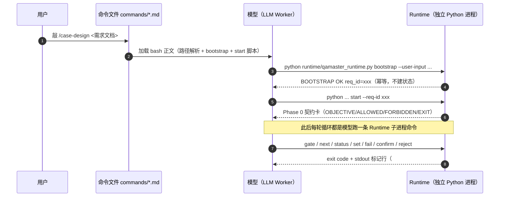
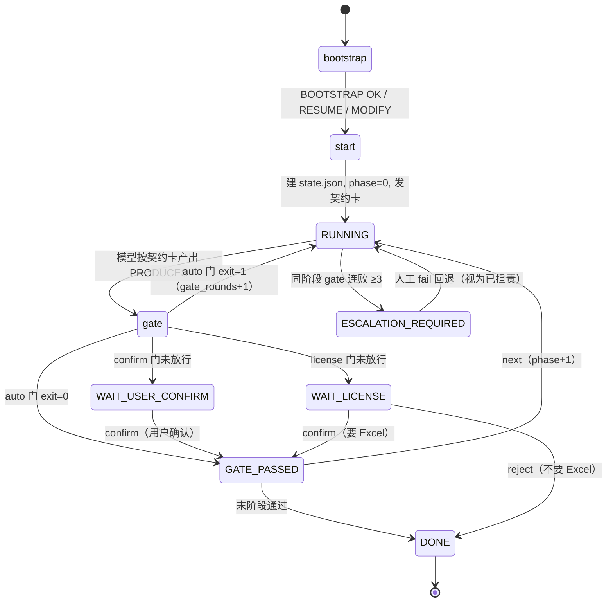
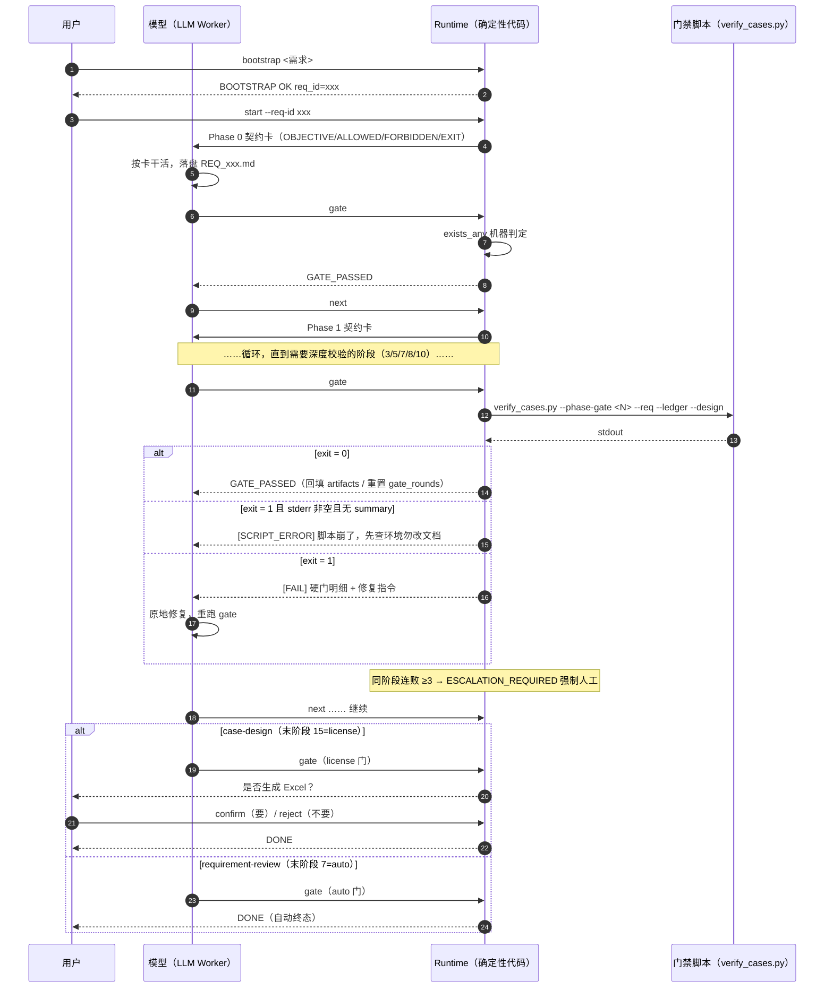
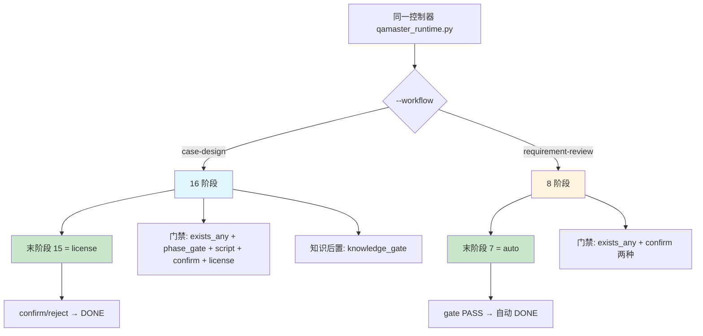
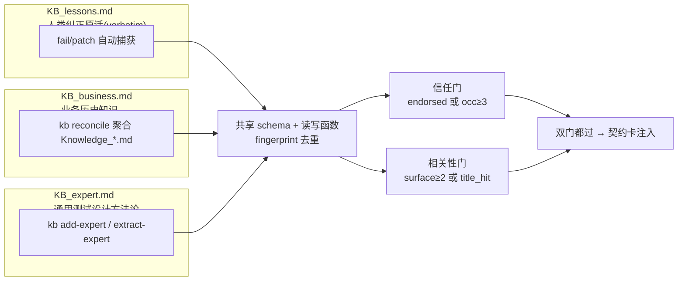
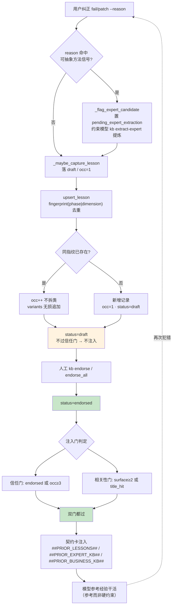
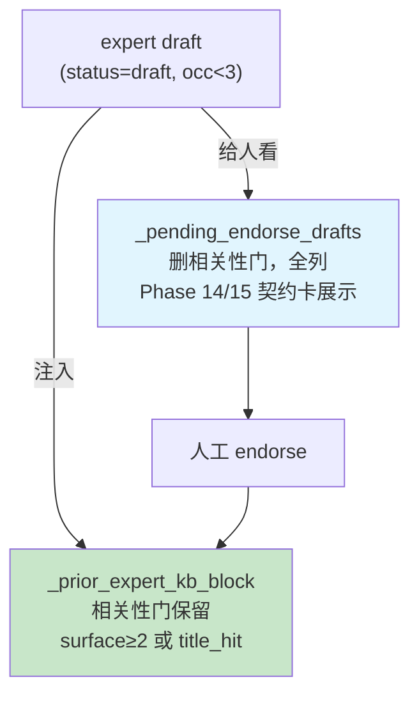

# qamaster 流程与模型无关：实现原理与落地方法

> 一份面向「小白」的完整解读：qamaster 到底靠什么，让「流程」完全不受底层大模型（LLM）的影响？
> 本文把原理讲透，并配每一处关键代码的 `文件:行号`，读完即可自行核对源码。

---

## 0. 一句话结论

> **模型负责思考，Runtime 负责控制。任何模型不可绕过。**

qamaster 把「一条流程怎么走」这件事，从大模型手里彻底夺走，交给一套**纯 Python 标准库写的确定性状态机**（`runtime/` 目录）来裁决。模型（无论 GPT、Claude 还是别的）在流程里只有一个角色：**按 Runtime 发给它的「契约卡」干活**，其余全部动作——阶段推进、门禁判定、状态变更、共享资源写入——都由 Runtime 的确定性代码执行。

模型想「跳过阶段」「自己宣布完成」「凭印象填校验数值」，在 qamaster 里**统统做不到**，因为做这些事的入口根本不在模型手里。

---

## 1. 三层架构：控制与智能分离

qamaster 的全部秘密，就是把「流程控制」和「模型智能」拆成互不依赖的三层：

| 层 | 组成 | 职责 | 用什么语言 |
|---|---|---|---|
| **① 流程控制层（Runtime）** | `runtime/*.py` | 状态机、门禁裁决、状态持久化、共享资源独占 | 纯 Python 标准库，**零模型** |
| **② 业务规范层（Skill）** | `skills/*/SKILL.md` + `references/*.md` | 定义「每个阶段该做什么、不该做什么、怎么判定」 | Markdown 规范文本 |
| **③ 模型执行层（LLM Worker）** | 任意大模型 | 只在契约卡划定的格子里产出内容 | 无所谓 |

关键点：**第②层的规范是给「人」和「模型」读的；第①层的代码才是真正"卡流程"的东西。** 模型读不懂规范、或者故意不遵守，都没关系——因为第①层会在模型每一次想推进时，用确定性代码拦截它。

三层之间唯一的接口就是一张**契约卡（Contract Card）**，见 §2.2。

---

## 1.5 入口触发链：从敲下命令到 Runtime 接管

> 这一节回答一个关键问题：**启动 skill 时，Runtime 是怎么被拉起来的？** 答案是——**不是"自动触发"，而是模型按命令文件里的 bash，亲手把 Runtime 拉起来当独立子进程跑。** 这正是"流程与模型无关"在入口处的第一道落地。

### 1.5.1 先破一个误解：没有"自动触发"

很多人以为"启动 skill → Runtime 自动接管"，这是错的。qamaster **没有 hook、没有插件自动加载机制**：

| 查证点 | 文件 | 结论 |
|---|---|---|
| 插件清单 | `.claude-plugin/plugin.json` | 只有 name/version/description/keywords，**无 hooks 字段** |
| 市场清单 | `.claude-plugin/marketplace.json` | 只有插件元数据，**无启动逻辑** |
| 权限配置 | `.claude/settings.local.json` | 只有 `permissions.allow` 白名单（一堆 `Bash(python *)`），**无 hooks 字段** |

真正的"触发者"是**模型自己**：它读到命令文件里写好的 bash，用 Bash 工具去执行 `python runtime/qamaster_runtime.py ...`，把 Runtime 当作**独立的 Python 子进程**拉起来。

> 换句话说：Runtime 不是模型的"插件钩子"，而是模型**主动调用**的一个外部程序。模型的角色止步于"发起调用"，判定与推进全在这个外部程序里。

### 1.5.2 真正的入口：`commands/*.md` 斜杠命令文件

用户敲 `/case-design`，Claude 加载的不是 skill 本体，而是**斜杠命令文件** `commands/case-design.md`。它 frontmatter 只有 `description` + `argument-hint`，正文是**硬编码的 bash 脚本**——这才是把 Runtime 拉起来的那段代码。

```bash
# commands/case-design.md 的「路径解析」：先定位 Runtime 在哪
PLUGIN_ROOT=""
for c in \
  "$(cd "$(dirname "$0")/.." 2>/dev/null && pwd)" \
  "$HOME/.claude/plugins/qamaster" \
  $(ls -d "$HOME"/.claude/plugins/cache/qamaster/qamaster/*/ 2>/dev/null | sort -V | tail -1) \
  "D:/qamaster" \
; do
  [ -n "$c" ] && [ -f "${c%/}/runtime/qamaster_runtime.py" ] && PLUGIN_ROOT="${c%/}" && break
done
```

4 个候选路径**逐一 `[ -f ]` 探测，取第一个命中**：本地仓库、plugins 目录、marketplace 缓存安装（glob 取版本号最大者）、开发仓库。这一层探测就是为了兼容"同一份命令文件被装到不同位置"的三平台场景。

### 1.5.3 五步触发链（case-design 为例）

```
① 用户敲 /case-design <需求文档>
        │
② Claude 加载 commands/case-design.md（斜杠命令文件，非 skill 本体）
        │
③ 路径解析：4 候选探测 → 定位 PLUGIN_ROOT（runtime 所在目录）
        │
④ 模型 Bash 执行：python runtime/qamaster_runtime.py bootstrap ...   ← 派生 req_id（不建状态）
        │
⑤ 模型 Bash 执行：python runtime/qamaster_runtime.py start ...      ← 建状态 + 发 Phase 0 契约卡
        │
  之后进入每轮循环：gate / next / status / set / fail / confirm / reject
  （每一步都是模型跑一条 runtime 子进程命令，Runtime 用 exit code + stdout 标记行回话）
```

对应 `commands/case-design.md:35-41` 的真实代码：

```bash
# ① bootstrap 派生 req_id（幂等，可重跑）
REQ_ID=$(python "$PLUGIN_ROOT/runtime/qamaster_runtime.py" bootstrap \
    --workflow case-design --user-input "$ARGUMENTS" --workdir "$(pwd)" \
    | sed -n 's/.*req_id=\([^ ]*\).*/\1/p' | head -1)
# ② start 按 (workflow, req_id) 创建/续跑状态，输出 Phase 0 契约卡
python "$PLUGIN_ROOT/runtime/qamaster_runtime.py" start \
    --workflow case-design --req-id "$REQ_ID" --workdir "$(pwd)"
```

关键点：

- **`req_id` 由 bootstrap 派生**，不是模型在阶段里现编——消除"先有鸡还是先有蛋"。文件取首个 `# ` 标题清洗，内联取首个非空行，去重碰撞加 `-YYYYMMDD`。
- **bootstrap 幂等**：不创建状态，可重跑；检测到在途状态输出 `RESUME`，`start` 走断点续跑分支。
- 从第 ③ 步往后，模型的每一句"推进"都是**一条独立的 Runtime 子进程调用**——模型手里没有流程状态，每次都要 `status` 去问。

### 1.5.4 `disable-model-invocation: true` 的真实含义

两份 SKILL.md 的 frontmatter 第 4 行都有这一行（`skills/case-design/SKILL.md:4`、`skills/requirement-review/SKILL.md:4`）：

```
---
name: case-design
description: ...
disable-model-invocation: true
---
```

它的意思是：**禁止模型"按 skill 名字直接调用"**——即模型不能把 SKILL.md 当作一个可自由进入的 skill 直接加载执行。skill 只能被命令文件（以及命令文件背后的 Runtime）拉起来。

> 这一行的存在，恰好印证了开篇那句"流程控制权不在模型"：模型连"进入流程"这个动作都不是自由发生的，而是被 `/case-design` 命令文件框定好、再经 Runtime 接管。

### 1.5.5 为什么 Runtime 必须是独立进程

这是整个设计的支点：

- **Runtime 是同一份 Python 代码，模型可以随便换**（GPT / Claude / Codex / Cursor），Runtime 一行不改。
- **命令文件 = 薄引用（thin reference）**：三平台各自只写"一句 bash 拉起同一份 `runtime/qamaster_runtime.py`"，就完成了接入。这就是 `marketplace.json` 里写的"三平台薄引用适配"。
- **模型只发起调用，判定权在子进程**：Runtime 用 `exit 0/1` + `##VERIFY_SUMMARY##` 等 stdout 标记行回话，模型只读结果、不参与判定。

```
                 ┌────────────────────────────────────────────┐
                 │  commands/case-design.md（bash 薄引用）       │
                 │  python runtime/qamaster_runtime.py ...     │
                 └───────────────────┬────────────────────────┘
                                     │ 子进程调用
                                     ▼
                 ┌────────────────────────────────────────────┐
                 │  runtime/（纯 Python 标准库，零模型）         │
                 │  状态机 · 门禁 · 契约卡 · 共享资源独占         │
                 └───────────────────┬────────────────────────┘
                                     │ 发契约卡 / 收 exit code
                                     ▼
                 ┌────────────────────────────────────────────┐
                 │  模型（LLM Worker，可替换）                   │
                 │  只在契约卡 ALLOWED 格子里产出内容            │
                 └────────────────────────────────────────────┘
```

### 1.5.6 两条 entry 的「薄厚」统一

两条流程拉起 Runtime 的**本质动作相同**（模型 Bash 执行 `python runtime/qamaster_runtime.py`），命令文件写法也已对齐为同款「厚命令」：

| entry | 命令文件写法 | 运行细节 |
|---|---|---|
| `/case-design` | **厚命令**：`commands/case-design.md` 内嵌完整 bash（路径解析 + bootstrap + start + gate 循环 + 5 铁律） | 命令文件自身 + SKILL.md「入口协议」 |
| `/requirement-review` | **厚命令（已统一）**：`commands/requirement-review.md` 内嵌同款 bash（路径解析 + bootstrap + start + gate 循环 + 5 铁律，显式 `--workflow requirement-review`） | 命令文件自身 + SKILL.md 开头「Runtime 控制协议」 |

> 两条入口最终都汇聚到同一份 `runtime/qamaster_runtime.py`，靠 `--workflow case-design|requirement-review` 路由到各自的状态机与门禁。入口命令里**显式写死 `--workflow`** 是硬约束——因为 Runtime 的 `--workflow` 默认值是 `case-design`（`qamaster_runtime.py:60`），漏传会静默串到另一条流程且不报错。两条入口都显式写明，即从源头锁死这一静默风险。

---

## 2. 十大机制：实现「模型无关」的具体手段

这十个机制合起来，就是「模型不可绕过」的完整防线。每一项都配 `文件:行号` 可核对。

### 机制 1：数据驱动的阶段机（Data-driven State Machine）

阶段不是写死在流程代码里的 `if/else`，而是一份**数据**——`PHASES` 列表，每个阶段是一个 dict：

```
runtime/phases.py                 — case-design 的 16 个阶段（0-15）
runtime/requirement_review_phases.py — requirement-review 的 8 个阶段（0-7）
```

每个阶段 dict 的结构（`requirement_review_phases.py:33`）：

```python
{
  "id": 0, "name": "输入预处理与需求定位", "gate": "auto",
  "objective": "...", "allowed": [...], "forbidden": [...],
  "produces": [...], "exit_condition": "...",
  "gate_checks": [{"kind": "exists_any", "patterns": [...], "label": "..."}],
}
```

> 因为阶段是数据，所以「加一个流程」=「加一份数据」（见 §5），控制器一行不改。

### 机制 2：契约卡 —— 发给模型的唯一控制协议

模型每次开工前，Runtime 会渲染一张契约卡（`runtime/qamaster_runtime.py:1327` `_card()`），这是模型**唯一**收到的控制信息。卡片内容包括：

- `CURRENT PHASE`（当前第几阶段、进度 x/y）
- `OBJECTIVE`（本阶段目标）
- `ALLOWED`（只允许做什么）
- `FORBIDDEN`（禁止做什么）
- `PRODUCES`（必须产出哪些落盘物）
- `EXIT CONDITION`（出口门禁）+ `GATE 类型`
- 外加若干注入块：`PRIOR_ARTIFACTS`、`PATCH_FEEDBACK`、`##PRIOR_LESSONS##`、`##PRIOR_EXPERT_KB##`、`##PRIOR_BUSINESS_KB##` 等

卡片第一行就写得明明白白（`qamaster_runtime.py:1340`）：

```
【RUNTIME CONTRACT — 由 qamaster Runtime 颁发，模型必须遵守，不得自改流程】
```

> 模型能看到的「流程视图」，永远只有这张卡，看不到也改不了背后真正的状态机。

### 机制 3：机器门禁 —— 判定权不在模型

每个阶段的出口，由 `gate_checks` 定义**确定性检查**。`_run_check`（`qamaster_runtime.py:1190`）支持四种 `kind`：

| kind | 判据 | 备注 |
|---|---|---|
| `exists` | 单文件存在 | |
| `exists_any` | glob 命中 ≥1 | `{req_id}` 占位替换，多需求并发隔离 |
| `phase_gate` | 调 `verify_cases.py --phase-gate <N>` 深度校验 | case-design 核心门 |
| `script` | 跑任意脚本 | Phase 13 全量校验、Phase 15 生成 Excel |

判定标准就一条铁律：**`exit 0` = 通过，`exit 1` = 不通过**。模型不能"自我认证"自己干完了。

### 机制 4：状态持久化 —— 模型改不了流程记忆

状态存在 `.qamaster/<workflow>/<req_id>/state.json`（`runtime/state_store.py:54`），用**原子写**（`mkstemp` + `os.replace`，`state_store.py:124`），4 次 PermissionError 退避重试。模型只能读，不能写。

### 机制 5：状态生命周期 —— 7 种 status 卡住每一步

阶段（phase）是「做到第几步」，状态（status）是「这一步停在哪」。7 种 status（`state_store.py:35-42`）：

| status | 含义 |
|---|---|
| `RUNNING` | 阶段进行中，产物未过门禁 |
| `GATE_PASSED` | 门禁已过，可 `next` 前进 |
| `WAIT_USER_CONFIRM` | 卡在人工确认门，等人回复 |
| `WAIT_LICENSE` | 卡在 Excel 许可门 |
| `REVIEW_PENDING` | 连跑/轻量下人工门「标注待审、自动放行」 |
| `ESCALATION_REQUIRED` | 自动门连续失败 ≥3 次，强制人工介入 |
| `DONE` | 全部完成（终态） |

### 机制 6：三种门禁类型 —— 机器 / 人工 / 许可

| gate | 谁判定 | 场景 |
|---|---|---|
| `auto` | 跑 `gate_checks`，确定性 exit code | 绝大多数阶段 |
| `confirm` | 人工确认（Runtime 只看运行模式 + 用户意图，不信模型自证） | case-design Phase 14、requirement-review Phase 4 |
| `license` | 询问是否生成 Excel | case-design Phase 15 |

### 机制 7：有界返修 —— 不会无限重试

自动门连续失败 ≥3 次（`gate_rounds[phase] >= 3`），状态切到 `ESCALATION_REQUIRED`，强制人工介入。防止模型陷入「改一版 → 不过 → 再改一版」的死循环。

### 机制 8：共享资源独占 —— MANIFEST / KB 模型碰不得

`MANIFEST.md`（需求索引）和 `KB_*.md`（经验库）是跨需求共享可变资源，**所有变更必须经 Runtime 在 `FileLock` 内完成**（`runtime/manifest.py:3`、`runtime/kb_store.py:6`）。契约卡铁律第 5 条明确：**模型禁止 Write/Edit MANIFEST.md**。

### 机制 9：WorkflowSpec 抽象 —— 一个引擎承载多条流程

控制器里没有任何硬编码业务细节，只认一个抽象接口 `WorkflowSpec`（`runtime/registry.py:17`）。case-design 和 requirement-review 两条完全不同的流程，由同一个控制器驱动，差异全部压进数据（详见 §5）。

### 机制 10：深度裁剪 + 覆盖硬门

- **深度裁剪**：heavy/medium/light 三档，`DEPTH_SKIPS` 决定裁掉哪些阶段（`phases.py` 里 `DEPTH_SKIPS = {"heavy":[],"medium":[4],"light":[3,4]}`）。
- **覆盖硬门**：把「核心用例先交付、其余留后续」的缩减行为从软提示升级为可配置硬门（`verify_cases.py:215` `COVERAGE_GATES`），详见 §7。

---

## 3. 完整运行时序图：从 bootstrap 到 DONE

### 3.1 状态机全景

```
                    ┌────────────────────────────┐
                    │  bootstrap（幂等，不建状态） │
                    │  派生 req_id，检查碰撞       │
                    └────────────┬───────────────┘
                                 │ 输出 BOOTSTRAP OK / RESUME / MODIFY
                                 ▼
                    ┌────────────────────────────┐
                    │  start --req-id             │
                    │  建/续跑 state.json          │
                    │  status=RUNNING, phase=0    │
                    └────────────┬───────────────┘
                                 │ 输出 Phase 0 契约卡
                                 ▼
                 ┌───────────────────────────────────┐
                 │  模型按契约卡干活，产出 PRODUCES      │
                 └────────────────┬──────────────────┘
                                  ▼
                    ┌─────────────────────────────┐
                    │   gate（出口门禁）            │
                    └───┬──────────┬──────────┬────┘
                        │          │          │
               auto 门   │   confirm门   │  license 门
                        ▼          ▼          ▼
                  跑 gate_checks  看运行模式   询问用户
                  exit 0?         +用户意图   要不要Excel
                        │          │          │
              ┌───FAIL──┤    ┌─WAIT─┐    ┌─WAIT─┐
              │         │    │       │    │      │
              │      PASS│    │ confirm│   │confirm│ reject
              ▼         ▼    ▼       ▼    ▼      ▼
         RUNNING   GATE_PASSED WAIT_USER  GATE_  DONE
         (gate_rounds+1)         _CONFIRM  PASSED
                                        │
              next ─────────────────────┤
                 │                       │
                 ▼                       │
         current_phase+1                 │
         status=RUNNING                  │
                 │                       │
                 └─────────循环──────────┘
```

### 3.2 一步步走（带关键代码）

**Step 0 · `bootstrap`** — `cmd_bootstrap`（`qamaster_runtime.py:1743`）：只派生 req_id、做碰撞检查，**不创建 state.json**（幂等）。三种输出：`BOOTSTRAP OK / RESUME / MODIFY`。

**Step 1 · `start`** — `cmd_start`（`qamaster_runtime.py:1786`）：写 state.json（`RUNNING, phase=0`），打印 Phase 0 契约卡；已有状态则 `resume` 断点续跑。

**Step 2 · 模型干活 → `gate`** — `cmd_gate`（`qamaster_runtime.py:1940`）核心分叉：
- auto 门：遍历 `gate_checks`，非 optional 检查全过 → `GATE_PASSED` + MANIFEST 副作用
- confirm 门：`_human_gate_decision`（`qamaster_runtime.py:2100`）只看运行模式 + 用户意图标记，不信模型自证
- license 门：同理 → `WAIT_LICENSE`

**Step 3 · `next`** — `cmd_next`（`qamaster_runtime.py:1901`）只允许 `current_phase + 1`；`RUNNING`/`WAIT_*` 状态直接拒绝。

**Step 4 · 人工门应答** — `cmd_confirm`（`qamaster_runtime.py:2131`）/ `cmd_reject`（`qamaster_runtime.py:2198`）。

**Step 5 · 出错回退** — `cmd_fail`（`qamaster_runtime.py:2215`）：目标阶段只能 `< 当前阶段`（禁止前进式 fail），回退裁剪 `completed`、重置 `gate_rounds`、顺带沉淀经验 draft。

**终态**：
- case-design：末阶段 15 是 license 门，`confirm`/`reject` 后 → `DONE`
- requirement-review：末阶段 7 是 auto 门，`gate` PASS 时直接 → `DONE`

> **关键洞察**：整个生命周期里，模型的角色只出现在「Step 2 按契约卡干活」这一格。其余每一步都是 Runtime 在跑确定性代码。模型连「我该走到哪了」都要先 `status` 问 Runtime。

---

## 4. verify_cases.py 门禁实现：逐条拆解

`skills/case-design/scripts/verify_cases.py`（3730 行）是「门禁以机器判定为准」的实体——独立第三方脚本，不依赖 Runtime，核心约定就一条：**`exit 0` = 过，`exit 1` = 不过**。

### 4.1 三层判定

| 层 | 判据 | 违约后果 |
|---|---|---|
| **硬门** `hard_violations` | 枚举/引用悬空/ID 跳号/REQ 缺失等 | `exit 1` |
| **覆盖硬门** `coverage_gate_failures` | #4-H/#6-H/#8-H/RK P0-P1 等 | `exit 1`（按 config 可降级） |
| **软探针** `soft` | 断言完整性/存储 schema/关键词覆盖等 | 只打印，**不改退出码** |

最终退出码（`verify_cases.py:3726`）：

```python
return 1 if (findings["hard_violations"] or gate_fails) else 0
```

### 4.2 核心检查项清单

| 检查 | 函数（行号） | 作用 |
|---|---|---|
| 用例 ID 唯一连续 | `check_ids`（`:580`） | 追溯性地基 |
| 字段枚举契约 | `check_fields`（`:608`） | 12 种测试类型 / 13 种维度 / 名称 4 段 / 固定列 |
| 模糊断言红线 | `check_assertions`（`:635`） | 抓「测试成功/功能正常/数据正确」 |
| 杜撰存储红线 | `check_storage`（`:663`） | 表名/字段/Redis Key 须来自技术摘要清单 |
| 去重 + 过度设计 | `check_duplicates`（`:675`）/ `check_overdesign`（`:708`） | |
| 项1 反向引用完整 | `check_citation_resolution`（`:922`） | R/RK/TP/API 悬空引用 = exit 1 |
| 项1b 追溯 section 内联 | `check_traceback_section_inlined`（`:963`） | 禁止「见 Phase N」指针 |
| 项1c section 顺序硬阻断 | `check_section_order`（`:1028`） | 追溯 section 必须在用例表之前（RC2 真凶） |
| 项2 ID 连续性 | `check_section_id_contiguity`（`:1076`） | RK/TP/API/SC 无跳号 |
| 项3 假设标签对账 | `check_assumption_resolution`（`:1107`） | 假设 A<n> 须登记 |
| 项4 台账接入 | `parse_clarification_ledger` + `check_ledger_propagation`（`:1147`/`:1227`） | 澄清台账成为校验对照源 |
| 项5 行为一致性 | `check_behavior_consistency`（`:1432`） | 用例断言 vs 台账事实矛盾 |
| 项8 REQ 缺失硬门 | `check_req_presence`（`:1538`） | REQ 缺失直接 exit 1 |

### 4.3 门禁与 Runtime 的通信协议

门禁脚本和 Runtime 靠**固定格式 stdout 行**通信：

- `##VERIFY_SUMMARY## k=v;...` 机器摘要块（`verify_cases.py:446`）——交付摘要逐字段摘抄，**禁止模型凭印象手填**
- `##PHASE_ARTIFACTS## <phase>:R=1-24(24);...` 制品 ID 范围——Runtime 回填 `state.json.artifacts`（`qamaster_runtime.py:481`）
- `[FAIL] ...` 硬违规明细行——Runtime 抓它拼修复指令

> 对 Runtime 而言，门禁脚本就是「跑一个子进程 → 读 stdout 标记行 → 看退出码」。模型只发起这次调用，**判定权完全在脚本**。

---

## 5. 两份 WorkflowSpec 对比：一个引擎承载两条流程

这是「模型无关」思想在架构层的最终体现：**控制器 `qamaster_runtime.py` 一行不改，就能跑两条业务完全不同的流程。**

### 5.1 差异对比表

| 维度 | case-design | requirement-review |
|---|---|---|
| 业务 | 需求 → 测试用例（质量工程） | 需求 → 多角色评审 → 重构文档 |
| 阶段数 | 15 阶段（0-15） | 8 阶段（0-7） |
| 门禁类型 | auto + confirm + license | auto + confirm（无 license） |
| 末阶段 | 15=license（人工许可门） | 7=auto（自动门直接 DONE） |
| 知识后置 | 有 `knowledge_gate` | 无 |
| 流程裁剪 | heavy/medium/light 可裁 | 无裁剪（`DEPTH_SKIPS` 全空） |
| 输出目录 | `case-design-out/` | `requirement-review-out/` |
| MANIFEST 列 | 9 列 | 7 列 |
| KB 三库 | 有 | 无 |

### 5.2 控制器为什么「零改动」

控制器只认抽象接口 `WorkflowSpec`（`runtime/registry.py:17`）：

```python
@dataclass
class WorkflowSpec:
    name: str                 # 状态分区路径 + --workflow 取值
    output_dir: str           # 产物目录
    skill_dir: str            # skill 根
    phases: List[Dict]        # ★ 阶段机数据（唯一真正的差异）
    depth_skips: Dict         # 裁剪表
    knowledge_gate: List      # 后置门禁
    extra_card_text: Callable # ★ 专属卡片文案钩子
```

所有流程命令通过 `spec` 间接操作，差异被压进数据：

- `cmd_next` 调 `spec.next_phase_id()`（`registry.py:63`）——不关心有哪些阶段
- `cmd_gate` 读 `phase["gate"]` / `phase["gate_checks"]`——不关心门禁查什么
- `_card` 渲染调 `spec.extra_card_text()`（`qamaster_runtime.py:1403`）——不关心专属文案
- `_manifest_side_effect` 按 `spec.name` 分派（`qamaster_runtime.py:1516`）——各自维护 MANIFEST
- MANIFEST 列集由 `_SCHEMAS` 按 workflow 区分（`manifest.py:33`）

### 5.3 门禁数据的差异

**case-design**（`phases.py`）用 `phase_gate` 深度校验：

```python
{"id": 3, "name": "规则建模", "gate": "auto",
 "gate_checks": [{"kind": "phase_gate", "phase": 3, "label": "规则来源+R连续性(项1/2)"}]}
```

**requirement-review**（`requirement_review_phases.py`）只有文件存在性检查：

```python
{"id": 0, "name": "输入预处理与需求定位", "gate": "auto",
 "gate_checks": [{"kind": "exists_any", "patterns": ["requirement-review-out/REQ_{req_id}.md"], "label": "需求文档已落盘"}]}
```

`{req_id}` 占位符经 `_fmt_cmd`（`qamaster_runtime.py:473`）替换，实现「多需求并发时 A 的产物不会误放行 B 的门禁」。

### 5.4 加新流程 = 填一份数据 + 注册

`_register_workflows`（`qamaster_runtime.py:72`）显式注册，`main()` 按 `--workflow` 路由。未来加第三个流程只需：

1. 写一份 `xxx_phases.py`（阶段机数据）
2. 写一个 `xxx.py` 的 `register()`（适配层）
3. 在 `_register_workflows` 加 `import xxx; xxx.register()`
4. 若 MANIFEST 列不同，在 `manifest._SCHEMAS` 加一个 schema 条目

**控制器、状态机、门禁引擎、文件锁、原子写——全部复用，一行不动。**

---

## 6. _run_check 的子进程通信细节：Runtime 与门禁脚本的「暗号协议」

### 6.1 `phase_gate` 拼出的命令（`qamaster_runtime.py:1223`）

```bash
python .../verify_cases.py --phase-gate <N> <checkpoint.md> \
    --req REQ_<id>.md [--ledger 台账.md] [--design 设计.md] --run-mode full
```

- **REQ 必需**，缺失直接阻断（`:1216`），堵死「不落盘 REQ 就宣称校验过」
- **ledger/design 可选**，不存在不传、不阻断（`:1225`）
- **`--run-mode` 透传**（`:1229`），让脚本决定覆盖门硬判还是降级

### 6.2 最关键的修复：区分「内容错」和「脚本崩」

旧版 `capture_output=True` 抓了 stderr 却**从不读取**——「脚本崩溃」和「检查通过但无输出」在 Runtime 视角无法区分，模型只收到空输出，反复改文档却永远过不了门。

修复（`qamaster_runtime.py:1237-1253`）：

```python
err_lines = (proc.stderr or "").strip().splitlines()
has_summary = any(ln.startswith("##VERIFY_SUMMARY##") for ln in all_lines)
script_error = bool(err_lines) and not has_summary   # ← 核心判定
```

- `has_summary=True` → 脚本正常跑完，按内容问题处理
- `stderr 非空 && 无 summary` → **`[SCRIPT_ERROR]`**：注入 stderr 前 40 行，明确告诉模型「**脚本/环境挂了，别改文档**」

这一刀把「模型瞎改文档」和「环境真有问题」彻底切开。

### 6.3 失败反馈的结构化（RC14 修复，`:1254-1271`）

1. 硬门 FAIL 明细：`[FAIL]` 行全量保留、上限 80 条
2. summary 行不截断：尾部 `gate_fails/hard_violations` 是判定核心，绝不切掉
3. stderr 尾部补捞：非 script_error 时补后 20 行

还有 **RC2「根因闭环」**（`:1272-1281`）：失败反馈出现「无可解析/未找到/section/顺序写反」时，自动追加 section 顺序自检提示——把「真因」直接写进反馈，模型不用再猜。

### 6.4 PASS 时的三个副作用（`:1282-1288`）

1. `_backfill_artifacts`（`:481`）：解析 `##PHASE_ARTIFACTS##` 回填 ID 范围，下游不靠记忆
2. 重置 `gate_rounds[phase]=0`
3. `_maybe_upgrade_depth_on_p0`（`:507`）：Phase 5 过门后若 `risk_p0p1>0`，自动升级 depth=heavy 补跑被裁剪阶段

---

## 7. 覆盖门：从「硬编码」到「配置驱动」

### 7.1 生效阶段读 config（RC21 修复）

```python
# verify_cases.py:276
COVERAGE_GATE_PHASES = set(_RULES.get("coverage_gate_phases", [8, 10, 13]))
```

历史 bug：覆盖门阶段被硬编码成 `(8,10,13)`，但 `phase_gate_map` 里 phase 8 没列 `coverage_gate_failures` 却实际跑了——**config 和实际行为不一致，改 config 不起作用**。修复后「哪些阶段跑覆盖门」和「每个阶段跑哪些检查」都归 config 管。

### 7.2 `phase_gate_map` 的 hard/soft 拆分（RC23 修复）

旧版软检查（`check_ledger_propagation`/`check_behavior_consistency`）和硬检查并列，但分派时软检查返回空子集——「列了但不阻断」，却误导维护者。修复后拆成两个子列表（`:3583-3595`）：

```python
if isinstance(phase_entry, dict):
    phase_checks = phase_entry.get("hard_checks", [])   # 参与阻断分派
    soft_checks  = phase_entry.get("soft_checks", [])   # 仅记录，不阻断
else:
    phase_checks = phase_entry   # 旧版扁平 list 兼容
    soft_checks  = []
```

### 7.3 四档硬度（`_gate_mode`，`:199`）

```python
full       = 硬门，违约 exit=1
auto_light = 完整模式仍硬；连跑/轻量降级为软告警
warn       = 只提示
off        = 关闭
```

RC12 修复的坑：旧版**不识别 `"warn"`**，把 config 配的软告警静默升级成硬门。

`coverage_gate_failures`（`:283`）的 `run_mode` 语义：`auto/light` 下 `auto_light` 门降级软告警；但 `req_trace_min_ratio`（#4-H）**不设模式豁免**，三种模式同比例硬判——「连跑允许未覆盖，但必须在交付摘要显式列未覆盖清单」。

---

## 8. KB 自我进化：从「纠正」到「经验注入」的完整链路

最「AI」的部分，但严守同一铁律——**捕获、去重、背书、检索、注入全是 stdlib 确定性代码，模型只产 content，经验内容归属人类**（`kb_store.py:8`）。

### 8.1 链路全景

```
用户纠正（fail/patch 的 --reason）
        │
        ▼
① 自动捕获 ── _maybe_capture_lesson       落 draft / occ=1（静默、best-effort）
        │      _flag_expert_candidate     命中可抽象信号 → 置 pending_expert_extraction
        ▼
② 去重累积 ── kb_store.upsert_lesson      fingerprint 命中 → occ++ 不拆类
        ▼
③ 人工背书 ── kb endorse / endorse_all    draft → endorsed
        ▼
④ 检索注入 ── 预防式（开工前）+ 反应式（失败时），双门/三门过滤
        ▼
⑤ 经验命中 → 契约卡 ##PRIOR_LESSONS## / ##PRIOR_EXPERT_KB## / ##PRIOR_BUSINESS_KB##
```

### 8.2 三库分离

| 库 | 存什么 | 捕获来源 | 注入方式 |
|---|---|---|---|
| `KB_lessons.md` | 人类纠正原话（verbatim） | fail/patch 自动捕获 | 预防式 + 反应式 |
| `KB_business.md` | 业务历史知识 | `kb reconcile` 聚合 Knowledge_*.md | 仅 Phase 0 预防 |
| `KB_expert.md` | 通用测试设计方法论 | `kb add-expert`/`extract-expert` | 每阶段每轮预防 + 反应 |

三份文件共享同一套 schema 和读写函数（`kb_store.py:30-63` 定义三份横幅）。

### 8.3 捕获：为什么「静默」

`_maybe_capture_lesson`（`qamaster_runtime.py:773`）挂 `cmd_fail`/`cmd_patch`（**不挂 gate_fail**，因无人类文本）。四个不变量（`:777-780`）：

1. **静默**——除 WARN 外无 stdout
2. **best-effort**——锁超时/写失败只 WARN，纠正永远成功
3. **不写 per-req history**——KB 文件自带审计
4. **落 draft/occ=1**——过不了信任门，不注入，输出与无 KB 时逐字节一致（护 `150/0` 回归）

> 关键工程约束 **150/0**：有 KB 注入和无 KB 两种情况下，契约卡输出必须逐字节一致（除非真有过双门经验），否则任何回归测试都会在「无意触发注入」时炸掉。

### 8.4 去重：指纹累积，occ 才是「强现实信号」

`kb_store.fingerprint`（`:257`）按 kind 派发键：
- lesson：`(phase, dimension)`
- business：`(module, dimension)`
- expert：`(category, principle[:40])`

关键（`:260-267`）：`error_type` 对 fail/patch **恒为「人工纠正」不入指纹**，所以不同措辞的同类错误合并到同一条，`occurrences` 才能真正跨需求累积（否则永远=1，自我进化失效）。不同措辞无损追加进 `variants`（`:312`）。

### 8.5 注入的「双闸」：信任门 + 相关性门

一条经验要注入，必须**同时**过两道门：

**信任门**（`qamaster_runtime.py:926`）：
```python
trusted = (status == "endorsed") or (occurrences >= 3)
```
要么人工背过书（endorsed），要么同指纹被 ≥3 个独立需求命中（occ≥3 是「强现实信号而非模型自信」）。

**相关性门**（`qamaster_runtime.py:919-924`）：
```python
relevant = surface >= 2 or title_hit
```
`surface` = 触发词在 REQ 正文命中数（去子串遮蔽后 ≥2）；`title_hit` = module 名出现在 REQ 正文。

双门都不过 → 返回 `""` → 卡片与无 KB 时逐字节一致（护 150/0）。

### 8.6 三个「词域错配」修复：最硬的工程债

相关性门 `surface≥2` 听起来简单，但历史上炸了三轮，全是「方法论术语 vs 业务散文」的词域错配：

- **RC-d**（`qamaster_runtime.py:682` `_REQ_SIGNALS`）：expert trigger 由人填方法论术语（判定表/AND门），而注入门做 REQ 正文逐字命中——业务散文写「必须同时满足以下全部条件…」不含方法论词，命中 0 次，endorsed 也永不注入。修复：把 REQ 域措辞在落盘时自动并入 trigger。
- **RC-e**（`qamaster_runtime.py:662` 子串遮蔽去重）：「大于」⊂「大于等于」，一处出现双计误满足 surface≥2。修复：剔除被更长词包含的短词。
- **RC-f**（`qamaster_runtime.py:708` 编号条件归一）：台账写「1./2./3.」而 trigger 存「条件1/条件2」，逐字不相交。修复：命中条件从句信号时归一，并加克制排除版本号/日期。

### 8.7 「暴露给人看」与「注入」解耦（RC-a 修复）

`_pending_endorse_drafts`（`qamaster_runtime.py:1168`）在 Phase 14/15 契约卡列出「仅卡信任门」的 draft 供人 endorse。

根因（`:1155-1167`）：v0.11.5 的修复**复制了注入门的相关性门**来筛「给人看的列表」，结果方法论术语匹配业务散文命中 0 次 → draft 连列表都进不去 → 人永远看不见 → 永不 endorse → **自我锁死死锁**。

修复一句话：「这条方法论通不通用」（endorse 判断）与「相不相关本次 REQ」（注入门）是**两个问题**。所以：
- **给人看**（`_pending_endorse_drafts`）：删相关性门，全列 draft
- **注入**（`_prior_expert_kb_block`）：相关性门保留

两者解耦后，draft → endorse → 注入的闭环才真正打通。

---

## 9. 总结

把六块内容串起来，就是「模型无关」的完整闭环：

| 维度 | 谁裁决 | 机制 |
|---|---|---|
| **走到哪一步** | Runtime 状态机 | 数据驱动阶段机 + 7 种 status（§3） |
| **做得好不好** | 门禁脚本 exit code | verify_cases.py 三层判定（§4） |
| **脚本崩 vs 内容错** | Runtime 判定 stderr | `[SCRIPT_ERROR]` 隔离（§6） |
| **门禁口径** | config 单一事实源 | COVERAGE_GATES + phase_gate_map（§7） |
| **越用越准** | stdlib 去重 + 人工背书 | KB 双门注入 + 词域修复（§8） |
| **一条引擎跑多流程** | WorkflowSpec 抽象 | 差异压进数据，控制器零改动（§5） |

最终回到开篇那句话：

> **模型负责思考，Runtime 负责控制。任何模型不可绕过。**

qamaster 把「凡是要判定、要推进、要写入共享资源」的地方，全部交给出确定性代码；模型只在被允许的格子里「思考」。这就是「流程与模型无关」的原理，和它的完整落地方法。

---

## 附录：关键文件速查

| 文件 | 职责 |
|---|---|
| `commands/case-design.md` | `/case-design` 入口：内嵌 bash，拉起 Runtime（bootstrap→start 链 + 5 铁律） |
| `commands/requirement-review.md` | `/requirement-review` 入口：内嵌 bash（同款，显式 `--workflow requirement-review`） |
| `runtime/qamaster_runtime.py` | 核心控制器（2949 行）：契约卡、门禁、状态机、KB 注入 |
| `runtime/state_store.py` | 状态持久化（原子写）+ 7 种 status |
| `runtime/phases.py` | case-design 16 阶段注册表（单一事实源） |
| `runtime/requirement_review_phases.py` | requirement-review 8 阶段注册表 |
| `runtime/registry.py` | WorkflowSpec 抽象 + 注册/路由 |
| `runtime/manifest.py` | MANIFEST.md 共享索引（read-modify-write） |
| `runtime/kb_store.py` | KB 三库自我进化（read-modify-write） |
| `runtime/locking.py` | 跨平台 FileLock（fcntl / msvcrt） |
| `skills/case-design/scripts/verify_cases.py` | 独立门禁校验器（3730 行） |
| `skills/case-design/scripts/verify_md.py` | Tier B 回读脚本（15 字段头校验） |
| `skills/case-design/SKILL.md` | case-design 业务规范（铁律/阶段） |
| `skills/requirement-review/SKILL.md` | requirement-review 业务规范（7-Agent 评审） |

---

## 附录 B：Mermaid 图（GitHub / VS Code 可直接渲染）

### B.0 入口触发时序（sequenceDiagram）

> 对应 §1.5：模型按命令文件里的 bash，把 Runtime 当独立子进程拉起——没有 hook，没有"自动触发"。



### B.1 状态生命周期（stateDiagram）



### B.2 完整运行时序（sequenceDiagram）



### B.3 两条流程的门禁类型对照（15 阶段 vs 8 阶段）

**case-design（16 阶段）**

| 阶段 | 名称 | gate | 门禁检查（kind） |
|---|---|---|---|
| 0 | 需求定位与输入分析 | auto | `exists_any` REQ + DESIGN(optional) |
| 1 | 需求分析与澄清 | **confirm** | 人工确认 |
| 2 | 测试需求分析 | auto | （内存） |
| 3 | 规则建模 | auto | `phase_gate` 项1/2 |
| 4 | 规格建模 SDD | auto | （内存） |
| 5 | 风险分析 | auto | `phase_gate` 项2 |
| 6 | 测试策略匹配 | auto | （内存） |
| 7 | 测试点建模 | auto | `phase_gate` 项2 |
| 8 | 用例生成 | auto | `phase_gate` 全量+引用 |
| 9 | 去重 | auto | （内存） |
| 10 | 覆盖率校验与反向追溯 | auto | `phase_gate` 覆盖硬门 |
| 11 | 输出前自查 | auto | （内存） |
| 12 | 对话展示投影 | auto | （内存） |
| 13 | 写盘与脚本回读 | auto | `script` verify_md + verify_cases |
| 14 | 人工审核门禁 | **confirm** | 人工确认 + `knowledge_gate`(后置) |
| 15 | Excel 生成 | **license** | `script` gen_excel |

**requirement-review（8 阶段）**

| 阶段 | 名称 | gate | 门禁检查（kind） |
|---|---|---|---|
| 0 | 输入预处理与需求定位 | auto | `exists_any` REQ |
| 1 | 并行评审 | auto | `exists_any` ReviewIssues |
| 2 | 结果汇总去重与冲突检测 | auto | （内存） |
| 3 | 优化方案总览 | auto | （内存） |
| 4 | 用户确认 | **confirm** | 人工确认 |
| 5 | 需求文档重构 | auto | `exists_any` ReviewedReq |
| 6 | 自动复查与二次修复 | auto | （内存） |
| 7 | 最终输出 | auto | `exists_any` ReviewedReq + ReviewIssues |

### B.4 两条流程的「终态路径」差异（flowchart）



### B.5 KB 自我进化链路（flowchart）

**三库的捕获来源 → 统一去重/背书 → 双门注入：**



**单条经验的完整生命周期（捕获 → 注入）：**



**「暴露给人看」与「注入」解耦（RC-a 修复）：**

